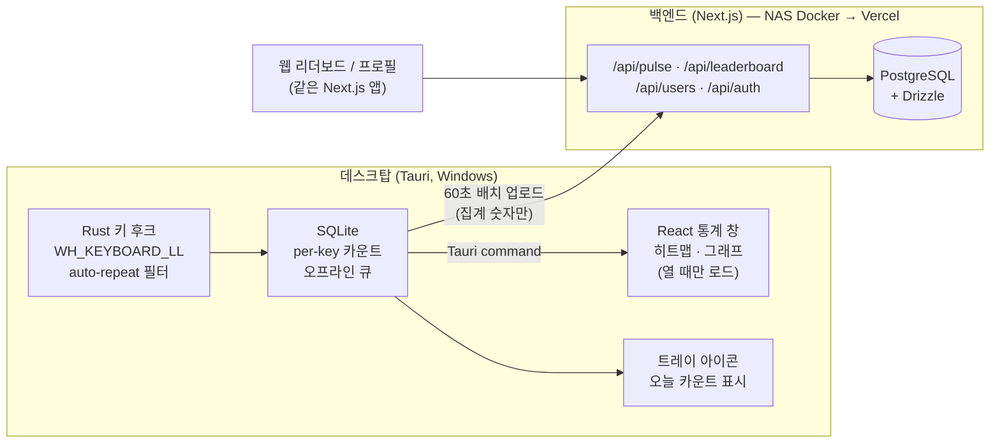

# TypingRank — 기획안

PC를 많이 쓰는 유저(개발자·게이머)의 **타이핑 양(누적 키 입력 수)**을 측정해 온라인 랭킹으로 경쟁시키는 Windows 데스크탑 앱 + 웹 리더보드. 타자 "속도"가 아니라 **"누적 입력량"**이 핵심 지표. `asdf` = 4.

> **포지셔닝**: WhatPulse(49만+ 유저, 2004년~, 동일 컨셉의 기존 강자)의 **모던 / 오픈소스 / 타이핑-온리** 버전. 마우스·대역폭·업타임은 빼고 "얼마나 쳤나"에만 집중. 개발자·게이머, 한국 커뮤니티 우선 타겟.

---

## 0. 확정 사항 요약 (TL;DR)

| 항목 | 결정 |
|------|------|
| 플랫폼 | **Windows 우선** (macOS/Linux는 v3+) |
| 데스크탑 | **Tauri 2 + React + TypeScript** (Rust 코어 상주, GUI는 통계 창 열 때만) |
| 키 후킹 | `windows` crate + `SetWindowsHookEx(WH_KEYBOARD_LL)` |
| 로컬 저장 | SQLite (Rust `rusqlite`, UI는 Tauri command로 조회) |
| 백엔드 | **Next.js 풀스택** (웹 + API Route Handlers 단일 앱) |
| DB | **PostgreSQL + Drizzle ORM** |
| 인프라 | **NAS Docker로 시작 → Vercel + 매니지드 Postgres 이전** (코드 수정 ~0 설계) |
| 배포 산출물 | **NSIS `setup.exe`** 단일 (본체는 `.exe`) |
| 코드 서명 | 초기엔 미서명 (SmartScreen 경고 안내로 대응), 유저 늘면 재검토 |
| 카운팅 규칙 | 물리 키 다운 1회 = 1, **auto-repeat 제외**, 모든 키 포함 |
| 저장소 구조 | pnpm 모노레포 (desktop / web / 공유 ui·types·db) |

---

## 1. 경쟁 분석 & 차별화

### WhatPulse (직접 경쟁, 사실상 동일 컨셉)
- 키 입력 **횟수** 카운트 + 웹 리더보드 + 국가/팀 랭킹 + anti-cheat + 키보드 히트맵 + "가장 많이 누른 키" — 기획의 기본·서브 기능이 전부 이미 존재.
- 활성 유저 49만+, 누적 9,000억+ 키 카운트. 유저층도 개발자·게이머로 동일.

### 파고들 틈 (리뷰에서 반복되는 약점)
1. **구린 UI / 느린 웹** — 레거시·신규 페이지 혼재, 앱 디자인 올드함 → 프론트엔드 강점으로 정면 승부.
2. **백화점식 기능** — 마우스·대역폭·업타임까지 전부 추적 → **타이핑-온리 미니멀**로 역차별화.
3. **폐쇄 소스** — 키로거-인접 카테고리인데 검증 불가 → **클라이언트 오픈소스**가 곧 신뢰이자 차별점.
4. **한국 로컬 커뮤니티 부재** — 국내 개발자·게이머 리더보드는 빈 자리.

### 보조 경쟁자
- ActivityWatch: 오픈소스지만 시간 추적 중심, 랭킹/경쟁 없음.
- cntr 등 오픈소스 카운터: WIP 수준, 온라인 랭킹 없음.

> 수익 제품이 아니라 **잘 만든 사이드 프로젝트 + 포트폴리오**로 접근. WhatPulse를 이기는 게 아니라 틈을 채우는 것.

---

## 2. 기술 스택 (확정 + 선정 이유)

| 영역 | 선택 | 이유 |
|------|------|------|
| 데스크탑 셸 | **Tauri 2** | 24h 트레이 상주 앱이라 풋프린트가 핵심. Electron(~150MB+ 상시) 탈락, C#/WinUI(GUI 반복속도·크로스플랫폼 불리) 탈락. Rust 코어에서 카운팅이 가볍게 돌고, webview(WebView2)는 통계 창 열 때만 로드 → 평시 수십 MB. |
| GUI | React + TS + Tailwind + shadcn/ui | 주력 스택으로 GUI 완성도 극대화. |
| 키 후킹 (Rust) | `windows` crate — `SetWindowsHookEx(WH_KEYBOARD_LL)` | Windows-only 정밀 제어. **auto-repeat 판별**: 저수준 훅에는 repeat 플래그가 없으므로 키 상태 테이블을 직접 유지 — 이미 down 상태인 키의 keydown은 무시, keyup에서 해제. 크로스플랫폼 확장 시 `rdev`로 교체 검토. |
| 로컬 DB | SQLite (`rusqlite`, Rust 코어에서 기록) | 카운팅 쓰기는 전부 Rust에서. React 통계 창은 Tauri command(invoke)로 읽기만. 오프라인 업로드 큐 겸용. |
| 백엔드 | **Next.js App Router** (웹 + `/api` Route Handlers 한 앱) | 웹과 API를 한 덩어리로 → NAS↔Vercel 이전 시 코드 수정 0. |
| ORM/DB | **Drizzle + PostgreSQL** | TS-first, 서버리스 친화. NAS Postgres → Neon/Vercel Postgres 이전 = config 교체 + `pg_dump` 1회. |
| 시각화 | 키보드 히트맵 = **커스텀 SVG 컴포넌트**, 시계열 = Recharts | 히트맵은 데스크탑·웹 양쪽에서 공유(모노레포 `packages/ui`). |
| Tauri 플러그인 | `autostart`(부팅 시 자동 실행 — 상주 앱 필수), `single-instance`(중복 실행 방지), `updater`(자동 업데이트) | 데스크탑 앱 기본기. |

---

## 3. 아키텍처



**철칙**: 키 이벤트는 Rust에서 카운터 +1만. 입력 순서·내용은 어디에도 저장하지 않는다. 서버로는 집계 숫자만 나간다.

---

## 4. 카운팅 규칙 (확정 — 나중에 바꾸면 데이터 전체 무효)

**모델: "물리 키 다운 이벤트 1회 = 1 카운트, auto-repeat 제외, 모든 키 포함"**

| 케이스 | 카운트 | 비고 |
|--------|--------|------|
| `asdf` | 4 | 기본 |
| Shift+A (대문자 A) | 2 | Shift down + A down. modifier도 물리 입력이므로 카운트 |
| 한글 `한` (ㅎ+ㅏ+ㄴ) | 3 | IME 조합 중 자모도 물리 키 다운이므로 카운트 |
| Backspace / 방향키 / F키 / Enter | 각 1 | "순수 입력량" 모델 — 전부 포함 |
| 키 꾹 누르기 (auto-repeat) | **0** | 키 상태 테이블로 필터. 어뷰징 1순위 방어 |

- per-key 카운트는 **물리 키 기준**(→ 리뷰 반영: `scanCode` 저장, 표시 라벨만 VK 매핑) → 히트맵 · "가장 많이 누른 키" 성립.
- "IME 확정 글자수" 같은 별도 지표는 v2+에서 추가 지표로만 검토 (기본 카운트 규칙은 불변).

---

## 5. 데이터 모델 (Drizzle / Postgres)

```
users
  id (pk) · username (unique) · api_token_hash (unique) · recovery_code_hash
  · country · timezone · created_at

pulses                       -- 클라이언트 배치 업로드 원본 (감사/재집계용)
  id (pk) · user_id (fk) · client_pulse_id (unique)   -- 멱등성 키
  · window_start · window_end · total_keys · created_at

user_stats                   -- 전체 누적 랭킹용 러닝 합계 (pulse마다 증분)
  user_id (pk, fk) · total_keys_alltime · updated_at

daily_stats                  -- 일/주/월/시즌 리더보드용 (date는 UTC 기준)
  user_id (fk) · date · total_keys        (uq: user_id+date, idx: date)

user_key_counts              -- 히트맵 (per-key 누적, upsert 증분)
  user_id (fk) · scan_code · count        (pk: user_id+scan_code)

user_app_counts              -- 카테고리(dev/game/chat)별 누적
  user_id (fk) · app_category · count     (pk: user_id+app_category)
```

> 랭킹 조회 시 전체 row 합산 금지. 전체 누적은 `user_stats` 인덱스 정렬로 즉시, 주/월은 `daily_stats` 범위 합산(스케일 시 materialized view 전환).

---

## 6. API 명세 (MVP)

| 메서드 | 경로 | 설명 |
|--------|------|------|
| POST | `/api/auth/register` | username 등록 → `api_token` + 복구 코드 발급 (서버는 해시만 저장) |
| POST | `/api/pulse` | 배치 업로드. Bearer 토큰 인증. body: `{ client_pulse_id, window_start, window_end, total_keys, app_counts?, injected_keys? }`. 서버측 어뷰징 캡 검증 → `pulses` insert(멱등) + 집계 테이블 증분 (트랜잭션) |
| POST | `/api/keymap` | per-key 카운트 **하루 1회** 업로드 (프라이버시: pulse와 분리) |
| GET | `/api/leaderboard?period=alltime\|daily\|weekly\|monthly&category=all\|dev\|game\|chat` | 랭킹 top N + 내 순위 |
| GET | `/api/users/:username` | 공개 프로필: 누적 합계, 히트맵 데이터, 시간대 패턴 |

**업로드 정책**: 클라이언트는 **60초 간격**(또는 종료 시) 로컬 집계를 1회 POST. 오프라인이면 SQLite 큐잉 → 복구 시 flush(같은 `client_pulse_id` 재사용). 키마다 전송 절대 금지.

---

## 7. 기능 로드맵

### MVP (Phase 0–1)
- 클라이언트: 트레이 상주(오늘 카운트 툴팁), 총합 + per-key 카운트, 60초 배치 업로드, 통계 창(누적 수치 + 키보드 히트맵), 부팅 자동 시작, 중복 실행 방지, **앱 카테고리 수집(수집만, 노출은 v2)**, **updater 설정 심기**.
- 웹: 전체 누적 글로벌 리더보드 + 개인 프로필(누적/히트맵).

### v2 — 경쟁 루프 완성
- **일간/주간/월간 + 시즌(분기 리셋)** 리더보드 — 누적만 있으면 신규 유저가 10년차를 못 이겨 이탈함. 필수.
- **앱 카테고리 리더보드 노출** (dev = IDE·터미널 / game / chat): `GetForegroundWindow` → 프로세스명 → 카테고리 매핑 테이블.
- 서브 지표: 시간대별 패턴, 백스페이스 비율(정확도 지표).
- 자동 업데이트 활성화, 어뷰징 탐지 강화.

### v3+
- 팀/길드, 친구 head-to-head, macOS·Linux 클라이언트, 국가별 랭킹.

---

## 8. 어뷰징 방어 (경쟁 제품 = 사실상 최우선 과제)

**클라이언트**
- auto-repeat keydown 무시 (키 상태 테이블 + 워치독 재동기화).
- **`LLKHF_INJECTED` 플래그 필터** — `SendInput` 기반 합성 입력(AHK 매크로 대부분)을 즉시 판별. 카운트에서 제외하고 `injected_keys`로 별도 집계해 서버에 보고.
- 동일 키 초당 임계치(예: 20회/s) 초과분 드롭.

**서버**
- 일일 상한(현실적 최대치, 예: 15만 키/일) 초과 pulse는 reject 또는 flag.
- 분당 입력률·특정 키 편중·`injected_keys` 비율 등 통계적 이상치 탐지.
- 플래그 계정은 리더보드에서 격리(데이터는 보존).
- `/api/pulse`, `/api/auth/register` rate limit.

> AHK/매크로 완전 차단은 불가능. "재미용 리더보드"로 포지셔닝하고 명백한 케이스만 거른다. 클라이언트 검증에 과투자하지 말 것 — 오픈소스라 우회 가능하므로 **서버측 통계 탐지가 본선**.

---

## 9. 프라이버시 설계 (= 신뢰 = 채택률)

구조적으로 키로거-인접 카테고리 → 타겟 유저(개발자)일수록 의심함.

- 키 이벤트 수신 시 **카운터 증분만**. 순서·단어·문장은 저장하지 않으며 재구성 자체가 불가능한 구조.
- 로컬 DB에는 집계(키별 카운트)만 기록 — 시퀀스 정보 없음.
- 서버 전송은 집계 숫자만. **pulse에는 총합만, per-key 카운트는 하루 1회** — 짧은 윈도우의 키 분포가 노출되지 않도록 분리.
- **클라이언트 오픈소스 공개** → "직접 확인하라"가 가능한 유일한 신뢰 장치이자 WhatPulse(폐쇄소스) 대비 차별점.
- 옵션: 비밀번호 입력 등 감지 불가 영역 안내 + 일시정지(pause) 단축키 제공.

---

## 10. Windows 빌드 & 배포

**산출물** — `tauri build` 실행 시 `src-tauri/target/release/`:
- `TypingRank.exe` — 실행 본체.
- `bundle/nsis/TypingRank_x.y.z_x64-setup.exe` — **배포용 설치 마법사 (이것 하나만 배포)**.
- Tauri 기본값은 MSI+NSIS 둘 다 생성 → `tauri.conf.json`에서 `bundle.targets: ["nsis"]`로 고정.

**런타임 의존성** — GUI는 Windows 내장 **WebView2** 사용. Win10/11 대부분 기본 탑재. 설치기에 WebView2 부트스트래퍼 옵션 활성화(`webviewInstallMode: downloadBootstrapper`)로 미탑재 PC 커버.

**권한** — UIPI 때문에 비-elevated 훅은 관리자 권한 프로세스의 입력을 받지 못한다. 관리자 권한 상주가 필요하며, 이 경우 Run 레지스트리 방식 autostart는 UAC 때문에 깨지므로 **작업 스케줄러("가장 높은 수준의 권한으로 실행") 등록**으로 자동 시작한다. → Phase 0에서 실측 확정.

**SmartScreen / 백신** — 미서명 exe는 첫 실행 시 "Windows의 PC를 보호했습니다" 경고. 키 후킹 앱이라 백신 오탐 가능성도 평균보다 높음. 대응:
- 초기: 미서명 배포 + 다운로드 페이지에 "추가 정보 → 실행" 안내 + 오픈소스 저장소 링크 + SHA256 체크섬으로 신뢰 보강.
- 유저 증가 시: **Azure Trusted Signing**(월 $10 수준) 우선 검토, 불가 시 OV/EV 인증서.
- 백신 오탐 발생 시 각 벤더 오탐 신고 프로세스 진행.

**개발 vs 배포**: `tauri dev`는 파일 산출 없이 즉시 실행(핫리로드), `tauri build`가 위 산출물 생성. 릴리스는 **`v*` 태그 push → GitHub Actions 빌드 → Release 업로드**로 자동화.

---

## 11. NAS → Vercel 이전 경로

| 구성요소 | 지금 (NAS) | 나중 (Vercel) | 이전 비용 |
|----------|-----------|--------------|-----------|
| Next.js (웹+API) | Docker, `output: "standalone"` + `next start` | `vercel deploy` | **코드 0** |
| Postgres | NAS Docker 컨테이너 | Neon / Vercel Postgres | `pg_dump` → restore, `DATABASE_URL` 교체 |
| 데스크탑 클라이언트 | API base = NAS 도메인 | **런타임 config 교체** | 재빌드 불필요 |

**처음부터 지킬 3가지 (이전 무통증의 전부)**
1. 클라이언트 API 주소는 **런타임 설정 파일**(`%APPDATA%\TypingRank\config.json`)로 외부화 — 빌드타임 env·하드코딩 금지. (업로더가 Rust 코어에 있으므로 `VITE_` env는 읽히지 않는다.)
2. Next.js `output: "standalone"` + 모든 비밀/접속 정보는 env로.
3. DB 접근은 전부 Drizzle 경유 + **드라이버를 env로 고르는 얇은 팩토리**를 `packages/db`에 둔다 (`pg` ↔ 서버리스 드라이버 전환용).

> NAS 노출은 포트포워딩 대신 **Cloudflare Tunnel** — 포트 개방 없이 HTTPS, DNS만 바꿔 Vercel 전환.

---

## 12. 모노레포 구조

```
typing-rank/
├─ apps/
│  ├─ desktop/                # Tauri 2 + React
│  │  ├─ src/                 # 통계 창 UI (React)
│  │  └─ src-tauri/           # Rust: 키 후크 · rusqlite · 배치 업로더 · 트레이
│  └─ web/                    # Next.js (웹 + /api) — NAS now, Vercel later
│     ├─ app/
│     │  ├─ api/              # pulse · leaderboard · users · auth
│     │  └─ (pages)/          # 리더보드 · 프로필
│     └─ Dockerfile           # NAS 배포용 (standalone)
├─ packages/
│  ├─ ui/                     # 공유 컴포넌트: 키보드 히트맵(SVG), 차트 래퍼
│  ├─ types/                  # 공유 타입: Pulse, KeyCounts, LeaderboardEntry …
│  └─ db/                     # Drizzle 스키마 + 클라이언트
└─ pnpm-workspace.yaml
```

히트맵 컴포넌트를 데스크탑 통계 창과 웹 프로필이 **공유** — 한 번 만들어 두 곳에 사용.

---

## 13. 개발 로드맵

| Phase | 목표 | 완료 기준 |
|-------|------|-----------|
| **0** | **키 후크 PoC** — 순수 Rust 바이너리로 auto-repeat 제외 정확 카운트 (Tauri 결합 전) | `asdf`=4 / Shift+A=2 / 한글 `한`=3 / 꾹누름=0. **관리자 권한 앱에서 카운트 여부 실측**. 주요 게임(Vanguard·EAC) 중 동작. 8시간 연속 무누수. 입력 지연 0 |
| **1** | MVP — Next.js(NAS Docker) + Postgres, register/pulse/leaderboard, 웹 리더보드 + 프로필 + 히트맵, NSIS 설치기, updater 설정 | 본인 PC 2대로 엔드투엔드 + 오프라인 큐 flush + 지인 배포 테스트 |
| **2** | 경쟁 루프 — 기간별·시즌 리더보드, 카테고리 노출, 서버 어뷰징 캡, 자동 업데이트 활성화 | 기간 랭킹 정상 롤오버, 이상치 pulse 차단, v0.x→v0.y 자동 업데이트 수신 확인 |
| **3** | Vercel + 매니지드 Postgres 이전, GUI 폴리시 | 이전 후 클라이언트 무중단 동작 |
| **4+** | 팀/길드 · head-to-head · 타 OS | — |

---

## 14. 리스크 & 미결정 항목

- **최대 리스크 = Phase 0 키 후크.** WH_KEYBOARD_LL 훅은 콜백이 느리면(기본 `LowLevelHooksTimeout` 300ms) OS가 훅을 조용히 무시하고 시스템 전체 입력 지연을 유발할 수 있음 → 콜백에서는 큐에 push만 하고 즉시 반환, 집계·DB 기록은 별도 스레드. 다른 작업 전에 이것부터 PoC로 확정.
- **키 상태 테이블의 keyup 유실** — Win+L 잠금·UAC·데스크탑 전환 중 keyup을 놓치면 해당 키가 영구히 "눌림"으로 남아 카운트가 조용히 새어나감 → `last_down_at` + `GetAsyncKeyState` 워치독 재동기화 필수.
- 게임 호환성: 일부 안티치트(Vanguard 등)가 저수준 훅과 충돌 가능 → PoC 단계에서 주요 게임 실행 중 동작 테스트.
- 코드 서명 비용 집행 시점 — 유저 반응 보고 결정.
- IME "확정 글자수" 보조 지표 — v2+ 검토 항목으로만 유지.
- 계정 시스템 고도화(이메일/소셜 로그인) — MVP는 username+토큰+복구코드로 충분, v2+에서 검토.
- **라이선스 미정** — 오픈소스 공개가 차별점이므로 조기 확정 필요.
