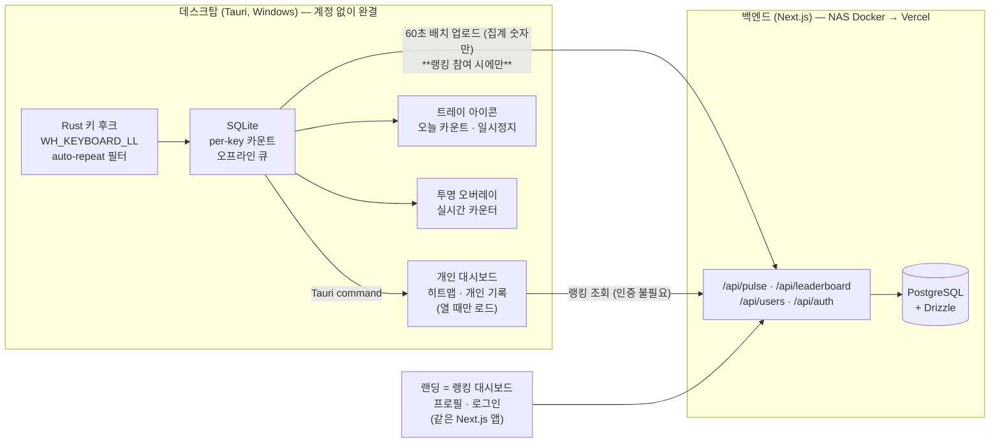

# TypingRank — 기획안

PC를 많이 쓰는 유저(개발자·게이머)의 **타이핑 양(누적 키 입력 수)**을 측정해 온라인 랭킹으로 경쟁시키는 Windows 데스크탑 앱 + 웹 리더보드. 타자 "속도"가 아니라 **"누적 입력량"**이 핵심 지표. `asdf` = 4.

> **포지셔닝**: WhatPulse(49만+ 유저, 2004년~, 동일 컨셉의 기존 강자)의 **모던 / 오픈소스 / 타이핑-온리** 버전. 마우스·대역폭·업타임은 빼고 "얼마나 쳤나"에만 집중. 개발자·게이머, 한국 커뮤니티 우선 타겟.

---

## 0. 확정 사항 요약 (TL;DR)

| 항목 | 결정 |
|------|------|
| 플랫폼 | **Windows 우선** (macOS/Linux는 v3+) |
| 제품 중심 | **개인(로컬) 대시보드가 앱의 얼굴.** 온라인 랭킹은 그 안의 메뉴 하나 |
| 계정 | **구글·카카오 OAuth** (웹에서 로그인 → 기기 연결 코드). **앱은 계정 없이도 완전히 동작** |
| 랭킹 참여 | **opt-in.** 참여 전에는 타이핑 데이터가 서버로 나가지 않는다. **집계는 참여 시점부터 — 과거 로컬 데이터 백필 금지** |
| 데스크탑 | **Tauri 2 + React + TypeScript** (Rust 코어 상주, GUI는 대시보드 열 때만) |
| 키 후킹 | `windows` crate + `SetWindowsHookEx(WH_KEYBOARD_LL)` |
| 로컬 저장 | SQLite (Rust `rusqlite`, UI는 Tauri command로 조회) |
| 백엔드 | **Next.js 풀스택** (웹 + API Route Handlers 단일 앱) |
| DB | **PostgreSQL + Drizzle ORM** |
| 인프라 | **NAS Docker로 시작 → Vercel + 매니지드 Postgres 이전** (코드 수정 ~0 설계) |
| 배포 산출물 | **NSIS `setup.exe`** 단일 (본체는 `.exe`) |
| 코드 서명 | 초기엔 미서명 (SmartScreen 경고 안내로 대응), 유저 늘면 재검토 |
| 라이선스 | **AGPL-3.0** (클라이언트·서버 전체 단일 라이선스) |
| 실시간 화면 표시 | **트레이 동적 아이콘 + 투명 항상-위 오버레이 창 (둘 다 MVP).** 오버레이 드래그 이동은 v2. Windows 11 위젯 보드는 배제 |
| 카운팅 규칙 | 물리 키 다운 1회 = 1, **auto-repeat 제외**, 모든 키 포함 |
| 저장소 구조 | pnpm 모노레포 (desktop / web / 공유 ui·types·db) |

---

## 1. 경쟁 분석 & 차별화

### WhatPulse (직접 경쟁, 사실상 동일 컨셉)
- 키 입력 **횟수** 카운트 + 웹 리더보드 + 국가/팀 랭킹 + anti-cheat + 키보드 히트맵 + "가장 많이 누른 키" — 기획의 기본·서브 기능이 전부 이미 존재.
- 활성 유저 49만+, 누적 9,000억+ 키 카운트. 유저층도 개발자·게이머로 동일.

### 파고들 틈 (리뷰에서 반복되는 약점)
1. **구린 UI / 느린 웹** — 레거시·신규 페이지 혼재, 앱 디자인 올드함 → 프론트엔드 강점으로 정면 승부.
2. **백화점식 기능** — 마우스·대역폭·업타임까지 전부 추적 → **타이핑-온리 미니멀**로 역차별화.
3. **폐쇄 소스** — 키로거-인접 카테고리인데 검증 불가 → **클라이언트 오픈소스**가 곧 신뢰이자 차별점.
4. **한국 로컬 커뮤니티 부재** — 국내 개발자·게이머 리더보드는 빈 자리.

### 보조 경쟁자
- ActivityWatch: 오픈소스지만 시간 추적 중심, 랭킹/경쟁 없음.
- cntr 등 오픈소스 카운터: WIP 수준, 온라인 랭킹 없음.

> 수익 제품이 아니라 **잘 만든 사이드 프로젝트 + 포트폴리오**로 접근. WhatPulse를 이기는 게 아니라 틈을 채우는 것.

---

## 2. 기술 스택 (확정 + 선정 이유)

| 영역 | 선택 | 이유 |
|------|------|------|
| 데스크탑 셸 | **Tauri 2** | 24h 트레이 상주 앱이라 풋프린트가 핵심. Electron(~150MB+ 상시) 탈락, C#/WinUI(GUI 반복속도·크로스플랫폼 불리) 탈락. Rust 코어에서 카운팅이 가볍게 돌고, webview(WebView2)는 통계 창 열 때만 로드 → 평시 수십 MB. |
| GUI | React + TS + Tailwind + shadcn/ui | 주력 스택으로 GUI 완성도 극대화. |
| 키 후킹 (Rust) | `windows` crate — `SetWindowsHookEx(WH_KEYBOARD_LL)` | Windows-only 정밀 제어. **auto-repeat 판별**: 저수준 훅에는 repeat 플래그가 없으므로 키 상태 테이블을 직접 유지 — 이미 down 상태인 키의 keydown은 무시, keyup에서 해제. 크로스플랫폼 확장 시 `rdev`로 교체 검토. |
| 로컬 DB | SQLite (`rusqlite`, Rust 코어에서 기록) | 카운팅 쓰기는 전부 Rust에서. React 통계 창은 Tauri command(invoke)로 읽기만. 오프라인 업로드 큐 겸용. |
| 백엔드 | **Next.js App Router** (웹 + `/api` Route Handlers 한 앱) | 웹과 API를 한 덩어리로 → NAS↔Vercel 이전 시 코드 수정 0. |
| ORM/DB | **Drizzle + PostgreSQL** | TS-first, 서버리스 친화. NAS Postgres → Neon/Vercel Postgres 이전 = config 교체 + `pg_dump` 1회. |
| 인증 | **Auth.js (NextAuth) — 구글·카카오** + 자체 기기 토큰 | OAuth는 **웹에서만** 처리한다. 데스크탑은 연결 코드로 기기 토큰만 받아 가므로 client secret이 클라이언트에 들어가지 않는다 — AGPL로 클라이언트를 공개하는 이상 이건 타협 불가다(§6). |
| 시각화 | 키보드 히트맵 = **커스텀 SVG 컴포넌트**, 시계열 = Recharts | 히트맵은 데스크탑·웹 양쪽에서 공유(모노레포 `packages/ui`). |
| Tauri 플러그인 | `single-instance`(중복 실행 방지), `updater`(자동 업데이트) | 데스크탑 앱 기본기. |
| 자동 시작 | **작업 스케줄러 직접 등록** (`autostart` 플러그인 ❌) | Phase 0 실측으로 관리자 권한 상주가 확정됐다. `tauri-plugin-autostart`는 `HKCU\...\Run`에 쓰는 사용자 컨텍스트 방식이라 elevated 프로세스를 띄우지 못한다(게다가 Run 항목이 사라지는 알려진 버그 plugins-workspace#771). 설치기가 작업 스케줄러 작업을 등록한다 — §11. |

---

## 3. 아키텍처



**철칙**: 키 이벤트는 Rust에서 카운터 +1만. 입력 순서·내용은 어디에도 저장하지 않는다. 서버로는 집계 숫자만 나간다.

**업로드 화살표는 opt-in이다.** 랭킹에 참여하기 전에는 저 경로가 아예 돌지 않는다(§7, §10). 반면 랭킹 조회는 로그인 없이도 동작하므로 앱이 서버에 GET은 보낸다 — "아무것도 안 나간다"가 아니라 **"타이핑 데이터는 나가지 않는다"**가 정확한 표현이다.

---

## 4. 카운팅 규칙 (확정 — 나중에 바꾸면 데이터 전체 무효)

**모델: "물리 키 다운 이벤트 1회 = 1 카운트, auto-repeat 제외, 모든 키 포함"**

| 케이스 | 카운트 | 비고 |
|--------|--------|------|
| `asdf` | 4 | 기본 |
| Shift+A (대문자 A) | 2 | Shift down + A down. modifier도 물리 입력이므로 카운트 |
| 한글 `한` (ㅎ+ㅏ+ㄴ) | 3 | IME 조합 중 자모도 물리 키 다운이므로 카운트 |
| Backspace / 방향키 / F키 / Enter | 각 1 | "순수 입력량" 모델 — 전부 포함 |
| 키 꾹 누르기 (auto-repeat) | **0** | 키 상태 테이블로 필터. 어뷰징 1순위 방어 |

- per-key 카운트는 **물리 키 기준**(→ 리뷰 반영: `scanCode` 저장, 표시 라벨만 VK 매핑) → 히트맵 · "가장 많이 누른 키" 성립.
- "IME 확정 글자수" 같은 별도 지표는 v2+에서 추가 지표로만 검토 (기본 카운트 규칙은 불변).

---

## 5. 데이터 모델 (Drizzle / Postgres)

**계정(사람)과 기기는 별개다.** OAuth는 사람을 인증하고, 60초마다 pulse를 올리는 건 기기다.
상주 앱이 OAuth 액세스 토큰을 계속 refresh하며 들고 있는 것보다, 로그인 시 **기기별 장기 토큰을
한 번 발급**받는 쪽이 안전하고 단순하다. 이 구조가 다중 PC(한 계정 N대 합산)도 같이 해결한다.

```
users                        -- 사람. OAuth 신원 하나 = 계정 하나
  id (pk) · provider (google|kakao) · provider_user_id
  · username (unique) · group_id (nullable — 기본 글로벌)
  · country · timezone
  · joined_ranking_at        -- 랭킹 집계 시작 시점. 백필 금지의 근거 (§15)
  · created_at
  (uq: provider + provider_user_id)

devices                      -- 기기. 데스크탑 클라이언트 1대 = 1 row
  id (pk) · user_id (fk) · name · token_hash (unique)
  · created_at · last_seen_at

link_codes                   -- 기기 연결 코드 (§6). 단명 레코드, 만료 후 정리
  code (pk) · device_token_hash · user_id (nullable — 승인 시 채움)
  · expires_at · consumed_at

pulses                       -- 클라이언트 배치 업로드 원본 (감사/재집계용)
  id (pk) · user_id (fk) · device_id (fk) · client_pulse_id
  · window_start · window_end · total_keys · created_at
  (uq: device_id + client_pulse_id)   -- 멱등성 키는 **기기 단위**.
                                      -- 전역 unique로 두면 두 기기가 같은 id를
                                      -- 만들었을 때 한쪽이 조용히 버려진다.

user_stats                   -- 전체 누적 랭킹용 러닝 합계 (pulse마다 증분)
  user_id (pk, fk) · total_keys_alltime · updated_at

daily_stats                  -- 일/주/월/시즌 리더보드용 (date는 UTC 기준)
  user_id (fk) · date · total_keys        (uq: user_id+date, idx: date)

user_key_counts              -- 히트맵 (per-key 누적, upsert 증분)
  user_id (fk) · scan_code · count        (pk: user_id+scan_code)

user_app_counts              -- 카테고리(dev/game/chat)별 누적
  user_id (fk) · app_category · count     (pk: user_id+app_category)
```

> 랭킹 조회 시 전체 row 합산 금지. 전체 누적은 `user_stats` 인덱스 정렬로 즉시, 주/월은 `daily_stats` 범위 합산(스케일 시 materialized view 전환).

**그룹은 `users.group_id` 하나로 끝난다.** 리더보드 쿼리에 `WHERE` 절이 하나 붙을 뿐이라 국가 랭킹과 동일한 구조다. 기능은 v2지만 **컬럼은 MVP에 넣는다** — 나중에 추가하면 그 이전 유저의 소속을 영영 모른다.

**집계 테이블은 전부 `user_id` 기준이라 기기를 구분하지 않는다.** 기기별 통계는 필요해지면 `pulses`에서 재집계하면 되므로(원본이 남아 있다) 지금 테이블을 늘리지 않는다.

---

## 6. API 명세 (MVP)

### 기기 연결 (OAuth)

데스크탑 앱은 **OAuth를 직접 처리하지 않는다.** 로그인은 웹에서만 일어나고, 앱은 연결 코드로 기기 토큰만 받아 온다.

| 메서드 | 경로 | 설명 |
|--------|------|------|
| POST | `/api/auth/link/start` | 앱이 호출. 6자리 연결 코드 + **미승인** 기기 토큰 발급. 앱은 코드를 화면에 띄우고 브라우저를 연다 |
| GET/POST | `/api/auth/link/:code` (웹) | 로그인한 유저가 코드를 승인. 최초 승인 시 `users` 생성 + `devices` 등록 |
| POST | `/api/auth/link/poll` | 앱이 폴링. 승인되면 기기 토큰이 활성화되고 이후 pulse에 쓴다 |
| — | `/api/auth/[provider]` | 구글·카카오 OAuth 콜백. **웹 전용** |

**왜 loopback 리다이렉트(`127.0.0.1:PORT`)를 쓰지 않나** — ⓐ 앱이 로컬 포트를 열어야 해서 Windows 방화벽 프롬프트가 뜨고, **키 후킹 앱이 포트를 여는 그림**은 신뢰에 정면으로 나쁘다. ⓑ 우리 앱은 관리자 권한 상주라 더 나쁘다. ⓒ 결정적으로, **AGPL로 클라이언트를 공개**하므로 OAuth client secret이 클라이언트에 들어가면 그대로 노출된다. 연결 코드 방식은 시크릿이 서버에만 남는다.

### 데이터

| 메서드 | 경로 | 인증 | 설명 |
|--------|------|------|------|
| POST | `/api/pulse` | 기기 토큰 | 배치 업로드. body: `{ client_pulse_id, window_start, window_end, total_keys, app_counts?, injected_keys? }`. 어뷰징 캡 검증 → `pulses` insert(멱등) + 집계 증분 (트랜잭션) |
| POST | `/api/keymap` | 기기 토큰 | per-key 카운트 **하루 1회** 업로드 (프라이버시: pulse와 분리) |
| GET | `/api/leaderboard?period=alltime\|daily\|weekly\|monthly&group=...` | **불필요** | 랭킹 top N. 로그인 시 내 순위 포함 |
| GET | `/api/users/:username` | **불필요** | 공개 프로필: 누적 합계, 히트맵, 시간대 패턴 |
| GET | `/api/users/me/export` | 세션 | 내 서버 데이터 전량 내보내기 (JSON) |
| DELETE | `/api/users/me` | 세션 | 계정 + 전체 데이터 삭제 |

**랭킹 조회는 인증이 필요 없다.** 앱에서도 웹에서도 로그인 없이 보인다 — 이게 "먼저 보고 나중에 참여"라는 진입 흐름(§7)의 전제다. 웹 SEO에도 유리하다.

**업로드 정책**: **60초 간격**(또는 종료 시) 로컬 집계를 1회 POST. 오프라인이면 SQLite 큐잉 → 복구 시 flush(같은 `client_pulse_id` 재사용). 키마다 전송 절대 금지. **랭킹 미참여 상태에서는 이 경로가 아예 돌지 않는다.**

---

## 7. 기능 로드맵

### 사용자 진입 흐름 (기준 시나리오)

기능 우선순위는 전부 이 흐름에서 나온다. **로컬이 먼저, 랭킹은 opt-in**이 핵심이다.

1. **랜딩 페이지**(= 랭킹 대시보드, §16)에서 설치기 다운로드. GitHub Releases도 동일 산출물.
2. 설치 → 실행. **계정 없이 즉시 카운트가 시작된다.** 개인 대시보드 · 트레이 아이콘 · 오버레이가 전부 로컬로 동작한다.
3. 대시보드 메뉴의 **랭킹**은 로그인 없이도 볼 수 있다(웹과 같은 데이터). 참여하려면 계정이 필요하다.
4. **구글 또는 카카오로 로그인** → 기기 연결(§6) → 그때부터 내 데이터가 랭킹에 포함된다. 기본 그룹은 글로벌.
5. 개인 대시보드는 계정과 무관하게 계속 나의 기록을 쌓는다.

**이 순서가 주는 것** — ⓐ 진입 장벽이 0이다. ⓑ **"계정을 만들기 전에는 타이핑 데이터가 서버로 나가지 않는다"**가 성립한다(§10). 키로거-인접 앱에서 이만한 신뢰 장치가 없다. ⓒ OAuth라 복구 코드·비밀번호 UX가 통째로 사라진다.

> **표현 주의**: 3번 때문에 앱은 랭킹 조회용 GET을 보낸다. "아무것도 안 나간다"는 부정확하다. **"타이핑 데이터는 나가지 않는다"**로 쓸 것. 이 프로젝트는 표현의 정확성 자체가 자산이라 여기서 과장하면 손해다.

### MVP (Phase 0–1)

**클라이언트 — 로컬만으로 완결되는 제품**
- **개인 대시보드가 앱의 얼굴.** 누적 수치, 키보드 히트맵, **개인 기록 갱신**(오늘 최다 타수 등).
- 트레이 상주 — **아이콘에 오늘 카운트 직접 렌더** + 툴팁. 부팅 자동 시작(§11), 중복 실행 방지.
- **투명 항상-위 오버레이**(§8) — Phase 0 스파이크로 검증 완료. 표시 타입 전환 포함, **드래그 이동은 v2**.
- **일시정지** — 트레이에서 즉시(5분 / 계속). §10 참조.
- 첫 실행 화면 — **무엇을 수집하고 무엇을 수집하지 않는지** 한 장. 계정 요구 없음.
- 앱 카테고리 **수집만** (노출은 v2). `updater` 설정 심기(활성화는 v2).
- **i18n(ko/en) 구조** — 나중에 넣으면 문자열이 코드에 박혀 비싸진다. 지금은 키 파일 하나 두는 비용.

**계정·업로드 (opt-in)**
- 구글 OAuth + 기기 연결(§6), 60초 배치 업로드 + 오프라인 큐.
- **업로드 상태 가시성** — 마지막 동기화 시각 + 대기 중 pulse 수. 조용히 쌓이면 "되는 건가" 의심이 생기고 그대로 문의가 된다.
- 카카오는 등록·검수 절차가 있어 **구글 다음**으로 뺀다(§15).

**웹**
- 랜딩 + 전체 누적 글로벌 리더보드 + 개인 프로필(누적/히트맵). §16.

### v2 — 경쟁 루프 완성
- **일간/주간/월간 + 시즌(분기 리셋)** 리더보드 — 누적만 있으면 신규 유저가 10년차를 못 이겨 이탈함. 필수.
- **그룹 리더보드 노출** — 컬럼(`users.group_id`)은 MVP에 이미 있다(§5). 여기서 UI만 붙인다.
- **앱 카테고리 리더보드 노출** (dev = IDE·터미널 / game / chat): `GetForegroundWindow` → 프로세스명 → 카테고리 매핑 테이블.
- **실시간 히트맵** — 방금 누른 키가 반짝인다. 설치 직후 히트맵이 비어 있는 "0일차 공허함"을 없앤다.
- **데이터 삭제·내보내기** — 로컬 DB 초기화, 서버 계정 삭제, JSON 내보내기(§6). 신뢰 카드로 쓰려면 앞당길 가치가 있다.
- 오버레이 **위치 드래그 이동**(§8), 서브 지표(시간대별 패턴, 백스페이스 비율).
- 자동 업데이트 활성화, 어뷰징 탐지 강화.

### v3+
- 팀/길드, 친구 head-to-head, macOS·Linux 클라이언트, 국가별 랭킹.

> **왜 개인 기록 갱신이 MVP인가.** 리더보드는 상위 1%만 재미있고 나머지는 순위가 안 움직여 이탈한다. 시즌 리셋(v2)도 결국 상대 경쟁이라 같은 한계를 갖는다. **"오늘 최다 타수 경신"은 남과 무관하게 매일 일어날 수 있는 성취**이고, 필요한 데이터는 로컬에 이미 다 있다. 비용 대비 효과가 이 목록에서 가장 크다.

---

## 8. 실시간 화면 표시 (오버레이 · 트레이)

"지금 몇 번 쳤나"를 화면에서 바로 확인하는 수단. **아래 채택안은 NSIS 패키징·관리자 권한 모델을 전혀 건드리지 않으므로 나중에 얹어도 매몰비용 0이다.** 반대로 "나중에 얹기 비싼" 유일한 선택지였던 위젯 보드는 애초에 불가능해 고민이 사라진다(아래 배제 항목).

### 채택 — 트레이 동적 아이콘 + 투명 항상-위 오버레이 창 (둘 다 MVP)

| 방식 | 시기 | 내용 |
|---|---|---|
| **트레이 아이콘 동적 렌더** | MVP | Tauri 2 `TrayIcon::set_icon()` / `set_tooltip()` 런타임 변경. 아이콘에 숫자를 직접 그려 넣는다. 추가 창·권한·패키징 변경 0 — 가장 싸고 가장 안 깨진다. |
| **투명 항상-위 오버레이 창** | **MVP** | Tauri 2 네이티브. `transparent: true` + `decorations: false` + `alwaysOnTop: true` + `skipTaskbar: true`. 실측 사례 기준 Windows 11에서 RAM 14MB / CPU 1% 미만. |

**트레이 숫자 표기 규칙 (지금 못박아 둘 것).** 16×16 아이콘에 `45,231`은 읽히지 않는다. **4자리를 넘으면 `45k`처럼 축약**하고, 전체 숫자는 툴팁에 넣는다. 구현 단계에서 정하면 자릿수가 넘어가는 시점마다 재량이 갈린다. **일시정지 중에는 아이콘이 눈에 띄게 달라져야 한다**(§10).

### 오버레이 표시 옵션

| 기능 | 내용 | 설계상 주의 |
|---|---|---|
| **위치 드래그 이동** | 오버레이를 마우스로 끌어 원하는 자리에 배치. 위치는 로컬 설정에 저장해 재시작 후 복원. 다중 모니터·해상도 변경 시 화면 밖으로 나가면 보정 | 오버레이는 **클릭 통과가 기본 ON**이라 마우스 이벤트가 창에 닿지 않는다. 드래그를 하려면 통과를 잠시 끄는 **이동 모드 토글이 선행**돼야 한다 (단축키 또는 트레이 메뉴) |
| **표시 타입 변경** | 미니멀 / 기본 / 맥시멈 등 정보 밀도를 전환. 게임 중엔 숫자만, 작업 중엔 지표까지 | 타입마다 창 크기가 달라진다. CSS만으로는 안 되고 **Rust에서 `set_size`를 함께 바꿔야** 한다 — 창이 내용보다 작으면 잘리고, 크면 클릭 통과를 껐을 때 빈 영역이 마우스를 먹는다 |

**레퍼런스 = OP.GG for Desktop.** 동일 방식(별도 투명 항상-위 창)이며 프로세스 인젝션·DirectX 후킹이 아니다. 스택만 Electron(상주 150MB+)이라 다르고, 풋프린트가 핵심 차별점인 이 프로젝트에는 Tauri가 맞다.

OP.GG 공식 문서가 명시하는 동작 요구 조건 — 우리에게도 그대로 적용된다고 보고 Phase 0에서 실측한다:

1. **관리자 권한** — 우리는 키 후크(UIPI) 때문에 **어차피 관리자 권한으로 뜨므로 공짜로 충족**된다. → **실측 OK (2026-07-25)**: 승격 프로세스에서 투명 항상-위 창이 정상 표시됐다. tauri#8308(v2 투명 창 회귀)은 재현되지 않았다.
2. **하드웨어 가속 필수** — 꺼져 있으면 투명 창이 아예 안 뜬다. Tauri의 WebView2도 Chromium 계열이라 같은 제약을 받을 가능성이 높다. → **미실측.** `WEBVIEW2_ADDITIONAL_BROWSER_ARGUMENTS=--disable-gpu`로 확인할 것.
3. **게임 창 모드 = Borderless 또는 Windowed** — 아래 참조. → **실측 OK**: borderless 게임 위에 표시됐고, 게임에 포커스가 있는 동안에도 카운트가 계속 올랐다.

### 제약 — 전체화면 독점에서는 안 보인다

exclusive fullscreen에서는 **어떤 오버레이도 표시되지 않는다.** 안티치트가 아니라 **OS 표시 규칙**이라 앱이 해결할 수 없다. OP.GG·Blitz 같은 1티어 제품도 우회하지 못하고 "Borderless로 바꾸세요" 안내로 처리한다. 우리도 동일하게 안내만 한다.

게임 화면 위에 진짜로 그리려면 DirectX 훅·프로세스 인젝션이 필요한데 **커널 안티치트(Vanguard·EAC) 밴 리스크가 실재하므로 하지 않는다.** 별도 OS 창 방식은 게임 메모리를 읽지도 쓰지도 않아 Riot이 공개적으로 허용하는 범주에 들어간다 (OP.GG는 Vanguard가 상시 구동되는 발로란트에서도 동작).

### 배제 — Windows 11 위젯 보드 (3중으로 막힘)

| 차단 요인 | 내용 |
|---|---|
| MSIX 패키지 아이덴티티 필수 | Tauri 2의 번들 타겟은 NSIS·MSI뿐. MSIX는 2022년부터 열려 있는 feature request(tauri#4818) |
| **MSIX × 관리자 권한 충돌** | MSIX는 설치 사용자 컨텍스트를 강제하고 `requireAdministrator`를 지원하지 않는다. 관리자 권한 상주가 필요한 이 앱과 정면 충돌 — **결정타** |
| Adaptive Cards만 렌더 | JSON 기반 템플릿. 커스텀 SVG 키보드 히트맵 불가 |

여기에 위젯 보드는 `Win+W`를 눌러야 보여 "실시간 확인"이라는 목적 자체와 어긋나고, Microsoft가 플랫폼을 방치 중이다(Build 2023 세션 → 2024 온디맨드 강등 → 2026 세션 0개).

> 우회 2가지는 기록만 해둔다. **(a)** NSIS 본체 + 로컬 SQLite를 읽는 별도 MSIX 위젯 앱 2개 배포 — 패키징·서명·심사가 2배라 값어치 없음. **(b) PWA 위젯 프로바이더** — Next.js 웹앱을 PWA로 만들면 MSIX를 우회할 수 있으나, 표시 데이터가 서버 기준(60초 배치 지연)이라 실시간이 아니다. v2+ 재미 요소로만 검토.

---

## 9. 어뷰징 방어 (경쟁 제품 = 사실상 최우선 과제)

**클라이언트**
- auto-repeat keydown 무시 (키 상태 테이블 + 워치독 재동기화).
- **`LLKHF_INJECTED` 플래그 필터** — `SendInput` 기반 합성 입력(AHK 매크로 대부분)을 즉시 판별. 카운트에서 제외하고 `injected_keys`로 별도 집계해 서버에 보고.
- 동일 키 초당 임계치(예: 20회/s) 초과분 드롭.

**서버**
- 일일 상한(현실적 최대치, 예: 15만 키/일) 초과 pulse는 reject 또는 flag.
- 분당 입력률·특정 키 편중·`injected_keys` 비율 등 통계적 이상치 탐지.
- 플래그 계정은 리더보드에서 격리(데이터는 보존).
- `/api/pulse`, `/api/auth/link/*` rate limit. 연결 코드는 짧은 만료 + 시도 횟수 제한(무차별 대입 방지).
- **가입 전 로컬 데이터 백필 금지** — 검증 불가능한 과거 데이터를 받으면 위 방어가 전부 무의미해진다. §15에 결정 기록.

> AHK/매크로 완전 차단은 불가능. "재미용 리더보드"로 포지셔닝하고 명백한 케이스만 거른다. 클라이언트 검증에 과투자하지 말 것 — 오픈소스라 우회 가능하므로 **서버측 통계 탐지가 본선**.

---

## 10. 프라이버시 설계 (= 신뢰 = 채택률)

구조적으로 키로거-인접 카테고리 → 타겟 유저(개발자)일수록 의심함.

- 키 이벤트 수신 시 **카운터 증분만**. 순서·단어·문장은 저장하지 않으며 재구성 자체가 불가능한 구조.
- 로컬 DB에는 집계(키별 카운트)만 기록 — 시퀀스 정보 없음.
- **랭킹에 참여하기 전에는 타이핑 데이터가 서버로 나가지 않는다** (§7 진입 흐름). 계정을 만들어야 업로드 경로가 열린다. 설치만 하고 로컬로 쓰는 것이 정상 사용 방식이다.
- 서버 전송은 집계 숫자만. **pulse에는 총합만, per-key 카운트는 하루 1회** — 짧은 윈도우의 키 분포가 노출되지 않도록 분리.
- **클라이언트 오픈소스 공개** → "직접 확인하라"가 가능한 유일한 신뢰 장치이자 WhatPulse(폐쇄소스) 대비 차별점.
- **AGPL-3.0** — 수정본을 배포하거나 네트워크 서비스로 제공하면 소스 공개 의무. 포크가 조용히 폐쇄소스 키로거로 바뀌는 경로를 라이선스로 차단하고, 동시에 서버 코드로 경쟁 호스팅 리더보드를 돌리는 것도 막는다(GPL은 서버 실행을 "배포"로 보지 않아 이걸 못 막음).
- **일시정지는 옵션이 아니라 1급 기능이다 (MVP).** 비밀번호·카드번호를 칠 때 끌 수 있어야 앱을 깔 마음이 든다. 트레이에서 한 번에 접근(5분 정지 / 계속 정지), 단축키 제공.
  - **정지 중임을 트레이 아이콘으로 명확히 표시한다.** 정지된 줄 모르고 하루치를 날리는 것이 최악의 경험이다.
- **데이터 삭제·내보내기** (v2, §6) — 로컬 DB 초기화 + 서버 계정 삭제 + JSON 내보내기. "오픈소스라 믿어라"를 내세우면서 "내 데이터 지우기"가 없으면 앞뒤가 안 맞는다. 타겟 유저(개발자)가 두 번째로 묻는 질문이다.

---

## 11. Windows 빌드 & 배포

**산출물** — `tauri build` 실행 시 `src-tauri/target/release/`:
- `TypingRank.exe` — 실행 본체.
- `bundle/nsis/TypingRank_x.y.z_x64-setup.exe` — **배포용 설치 마법사 (이것 하나만 배포)**.
- Tauri 기본값은 MSI+NSIS 둘 다 생성 → `tauri.conf.json`에서 `bundle.targets: ["nsis"]`로 고정.

**런타임 의존성** — GUI는 Windows 내장 **WebView2** 사용. Win10/11 대부분 기본 탑재. 설치기에 WebView2 부트스트래퍼 옵션 활성화(`webviewInstallMode: downloadBootstrapper`)로 미탑재 PC 커버.

**권한 — Phase 0에서 실측 확정됨 (2026-07-25).** 비-elevated 훅은 관리자 권한 프로세스의 입력을 **받지 못했다.** 관리자 권한으로 실행하니 일반·관리자 앱 양쪽 모두 잡혔다. 즉 UIPI 제약은 실재한다 → **관리자 권한 상주로 확정**. 따라서 자동 시작은 `HKCU\...\Run`이 아니라 **작업 스케줄러에 "가장 높은 수준의 권한으로 실행" 작업을 설치기가 등록**하는 방식으로 간다(§2). 부수 효과로, 관리자 터미널·작업 관리자 위에서 타이핑해도 카운트가 새지 않는다.

**SmartScreen / 백신** — 미서명 exe는 첫 실행 시 "Windows의 PC를 보호했습니다" 경고. 키 후킹 앱이라 백신 오탐 가능성도 평균보다 높음. 대응:
- 초기: 미서명 배포 + 다운로드 페이지에 "추가 정보 → 실행" 안내 + 오픈소스 저장소 링크 + SHA256 체크섬으로 신뢰 보강.
- 유저 증가 시: **Azure Trusted Signing**(월 $10 수준) 우선 검토, 불가 시 OV/EV 인증서.
- 백신 오탐 발생 시 각 벤더 오탐 신고 프로세스 진행.

**개발 vs 배포**: `tauri dev`는 파일 산출 없이 즉시 실행(핫리로드), `tauri build`가 위 산출물 생성. 릴리스는 **`v*` 태그 push → GitHub Actions 빌드 → Release 업로드**로 자동화.

---

## 12. NAS → Vercel 이전 경로

| 구성요소 | 지금 (NAS) | 나중 (Vercel) | 이전 비용 |
|----------|-----------|--------------|-----------|
| Next.js (웹+API) | Docker, `output: "standalone"` + `next start` | `vercel deploy` | **코드 0** |
| Postgres | NAS Docker 컨테이너 | Neon / Vercel Postgres | `pg_dump` → restore, `DATABASE_URL` 교체 |
| 데스크탑 클라이언트 | API base = NAS 도메인 | **런타임 config 교체** | 재빌드 불필요 |

**처음부터 지킬 3가지 (이전 무통증의 전부)**
1. 클라이언트 API 주소는 **런타임 설정 파일**(`%APPDATA%\TypingRank\config.json`)로 외부화 — 빌드타임 env·하드코딩 금지. (업로더가 Rust 코어에 있으므로 `VITE_` env는 읽히지 않는다.)
2. Next.js `output: "standalone"` + 모든 비밀/접속 정보는 env로.
3. DB 접근은 전부 Drizzle 경유 + **드라이버를 env로 고르는 얇은 팩토리**를 `packages/db`에 둔다 (`pg` ↔ 서버리스 드라이버 전환용).

> NAS 노출은 포트포워딩 대신 **Cloudflare Tunnel** — 포트 개방 없이 HTTPS, DNS만 바꿔 Vercel 전환.

---

## 13. 모노레포 구조

```
typing-rank/
├─ apps/
│  ├─ desktop/                # Tauri 2 + React
│  │  ├─ src/                 # 통계 창 UI (React)
│  │  └─ src-tauri/           # Rust: 키 후크 · rusqlite · 배치 업로더 · 트레이
│  └─ web/                    # Next.js (웹 + /api) — NAS now, Vercel later
│     ├─ app/
│     │  ├─ api/              # pulse · leaderboard · users · auth
│     │  └─ (pages)/          # 리더보드 · 프로필
│     └─ Dockerfile           # NAS 배포용 (standalone)
├─ packages/
│  ├─ ui/                     # 공유 컴포넌트: 키보드 히트맵(SVG), 차트 래퍼
│  ├─ types/                  # 공유 타입: Pulse, KeyCounts, LeaderboardEntry …
│  └─ db/                     # Drizzle 스키마 + 클라이언트
└─ pnpm-workspace.yaml
```

히트맵 컴포넌트를 데스크탑 통계 창과 웹 프로필이 **공유** — 한 번 만들어 두 곳에 사용.

---

## 14. 개발 로드맵

| Phase | 목표 | 완료 기준 |
|-------|------|-----------|
| **0** | **키 후크 PoC** — 순수 Rust 바이너리로 auto-repeat 제외 정확 카운트 (Tauri 결합 전) | `asdf`=4 / Shift+A=2 / 한글 `한`=3 / 꾹누름=0. **관리자 권한 앱에서 카운트 여부 실측**. 주요 게임(Vanguard·EAC) 중 동작. 8시간 연속 무누수. 입력 지연 0 |
| **1** | MVP — 로컬 완결 클라이언트(대시보드·트레이·오버레이·일시정지) + Next.js(NAS Docker)/Postgres + 구글 OAuth·기기 연결·pulse·leaderboard + 랜딩/프로필/히트맵 + NSIS 설치기 | **계정 없이 설치→카운트→대시보드**가 먼저 성립. 그 위에 본인 PC 2대를 같은 계정으로 연결해 합산 확인 + 오프라인 큐 flush + 지인 배포 테스트. **8시간 무누수는 이 단계로 이관** (Phase 0에서 미실측) |
| **2** | 경쟁 루프 — 기간별·시즌 리더보드, 카테고리 노출, 서버 어뷰징 캡, 자동 업데이트 활성화 | 기간 랭킹 정상 롤오버, 이상치 pulse 차단, v0.x→v0.y 자동 업데이트 수신 확인 |
| **3** | Vercel + 매니지드 Postgres 이전, GUI 폴리시 | 이전 후 클라이언트 무중단 동작 |
| **4+** | 팀/길드 · head-to-head · 타 OS | — |

### Phase 0 실측 결과 (2026-07-25)

| 항목 | 결과 |
|---|---|
| 카운팅 규칙 (`asdf`=4 / Shift+A=2 / `한`=3 / 꾹누름=0) | **OK** |
| 관리자 권한 앱 입력 | **OK** — 승격 시 일반·관리자 양쪽 다 잡힘. 비-승격은 못 잡음 (§11) |
| 안티치트 게임 중 동작 | **OK** — 게임 실행 중 정상 카운트, 튕김·입력 밀림 없음 |
| 콜백 최대 | **0.079 ms** (호출 806회 기준). OS 임계 300ms 대비 약 3,800배 여유 |
| 이벤트 유실 | **0** |
| 메모리 RSS (순수 Rust 후크) | **4.5 MB** |
| 8시간 연속 무누수 | **미실측 → Phase 1로 이관** (아래) |
| 하드웨어 가속 OFF에서 오버레이 | **미실측** — `WEBVIEW2_ADDITIONAL_BROWSER_ARGUMENTS=--disable-gpu`로 1분이면 확인된다 |

> **8시간 무누수를 Phase 1로 이관한 이유.** Phase 1 데스크탑 앱은 어차피 상주하며 며칠 돌고, 그게 8시간 단발 테스트보다 강한 검증이다. 다만 **그냥 미루면 검증이 사라지므로**, 그 테스트가 보려던 신호를 본체에 계측으로 남긴다 — ⓐ RSS 증가(메모리 누수), ⓑ **콜백 호출 정지 = 훅이 조용히 죽음**, ⓒ 워치독 보정 급증(keyup 유실). 특히 **ⓑ는 감지에 그치지 말고 훅 재설치까지 해야 한다.** 24시간 상주 앱에서 훅이 죽은 채 도는 것은 카운트가 0이 되는 것과 같고, 지금 PoC에는 감지만 있고 복구가 없다.

> **워치독 오탐 발견.** 203 카운트 구간에서 워치독 보정이 16회(약 8%) 잡혔다. PoC의 `watchdog()`이 §15가 명시한 `last_down_at`을 구현하지 않아, **채널에 대기 중인 keyup을 워치독이 앞질러 보고** "유실"로 오판하는 경주가 원인으로 보인다. 카운트 정확도에는 영향이 없으나(양쪽 다 `down=false`로 수렴) 보정 횟수가 keyup 유실 지표로서 무의미해진다. Phase 1 이식 시 **`last_down_at` 도입(1초 이상 눌린 키만 검사) + 워치독 전 채널 드레인**으로 수정한다.

> **Phase 0 곁다리 스파이크 (~30분).** 안티치트 호환성 테스트로 어차피 게임을 켜야 하므로, 그 김에 **일회용 최소 Tauri 앱**으로 오버레이를 함께 검증한다 — ① 관리자 권한 프로세스에서 투명 항상-위 창이 뜨는가 ② 하드웨어 가속을 끄면 렌더가 죽는가 ③ borderless 게임 위에 표시되는가 (§8). Phase 0 본체는 **순수 Rust 바이너리**이고 이 스파이크는 별개의 버리는 코드다 — 본체 Tauri 결합은 Phase 1이다.

---

## 15. 리스크 & 미결정 항목

- **최대 리스크 = Phase 0 키 후크.** WH_KEYBOARD_LL 훅은 콜백이 느리면(기본 `LowLevelHooksTimeout` 300ms) OS가 훅을 조용히 무시하고 시스템 전체 입력 지연을 유발할 수 있음 → 콜백에서는 큐에 push만 하고 즉시 반환, 집계·DB 기록은 별도 스레드. 다른 작업 전에 이것부터 PoC로 확정.
- **키 상태 테이블의 keyup 유실** — Win+L 잠금·UAC·데스크탑 전환 중 keyup을 놓치면 해당 키가 영구히 "눌림"으로 남아 카운트가 조용히 새어나감 → `last_down_at` + `GetAsyncKeyState` 워치독 재동기화 필수. **`last_down_at`을 빼면 워치독이 대기 중인 keyup을 앞질러 보고 오탐을 낸다 — Phase 0에서 실제로 재현됐다(§14).** 지연 없는 워치독은 지표를 망가뜨리므로 생략 금지.
- 게임 호환성: 일부 안티치트(Vanguard 등)가 저수준 훅과 충돌 가능 → PoC 단계에서 주요 게임 실행 중 동작 테스트.
- **Tauri v2 투명 창** — v1에서 되던 투명도가 v2에서 안 된다는 버그 리포트 존재(tauri#8308). 또 Tauri는 per-region hit-testing을 노출하지 않아, 영역별 클릭 통과는 커서 위치를 ~60fps로 폴링해 `set_ignore_cursor_events`를 토글하는 우회가 필요하다(컴파일된 Rust 루프라 오버헤드는 미미). 오버레이는 v2 작업이므로 그 시점에 재확인 — **Phase 0 스파이크에서 1차 확인 완료: 투명도는 정상 동작했다(tauri 2.11.5).** per-region hit-testing 우회는 아직 미검증이며, 드래그 이동 기능이 여기에 직접 걸린다(§8).
- 코드 서명 비용 집행 시점 — 유저 반응 보고 결정.
- IME "확정 글자수" 보조 지표 — v2+ 검토 항목으로만 유지.
- **가입 전 로컬 데이터의 랭킹 백필은 금지 — 확정.** 로컬 SQLite는 유저가 마음대로 고칠 수 있으므로, 백필을 허용하면 "DB 열어서 1억 타 넣고 가입"이 성립하고 §9의 방어선(서버측 통계 탐지)이 통째로 무의미해진다. 실시간 pulse는 속도·분포로 걸러낼 수 있지만 **과거 데이터 덩어리는 검증할 방법이 없다.** 랭킹 집계는 `users.joined_ranking_at`부터이며, 과거 로컬 데이터는 개인 대시보드에만 표시하고 UI에 그 사실을 명시한다. **나중에 뒤집기 매우 어려운 결정이라 MVP 전에 못박는다.**
- **카카오 OAuth는 앱 등록 + 동의 항목 검수 절차가 있다** (비즈 채널 연결 등). 무료지만 시간이 걸리므로 MVP는 **구글 먼저**로 자르고 카카오는 뒤이어 붙인다 — 검수 대기가 출시를 막지 않게.
- **포크 셀프호스팅 시 OAuth 앱은 각자 등록해야 한다** — AGPL로 서버 코드를 공개하지만 client secret은 배포물에 없다. README에 명시할 것.
- **기여자 CLA 미도입** — AGPL 하에서 외부 기여를 CLA 없이 받기 시작하면 저작권이 분산되어, 향후 듀얼 라이선스(수익화) 전환이 사실상 불가능해진다. **첫 외부 PR을 받기 전에** 도입 여부를 확정할 것.

---

## 16. 랜딩 페이지 & 배포 접점

랜딩은 별도 사이트가 아니라 **웹 앱(§2 Next.js)의 첫 화면**이다. 랭킹 대시보드가 곧 랜딩이고, 다운로드는 그 위에 얹힌다. 유입(랭킹 구경) → 설치 → 참여가 한 도메인에서 이어진다.

### 최대 이탈 지점은 기술이 아니다

진입 흐름(§7)에서 유저가 가장 많이 떨어지는 구간은 **다운로드 → 첫 실행 사이**다. 미서명 exe라 **SmartScreen 경고**가 뜨고, 곧바로 **관리자 권한 UAC**가 뜬다. 이중 관문이다.

랭킹도 오버레이도 이 구간을 통과한 유저만 본다. **설치기가 뜨기 전에, 다운로드 버튼 옆에서 미리 설명해야 한다:**

- **왜 관리자 권한이 필요한가** — UIPI 때문에 비-elevated 훅은 관리자 앱의 입력을 못 받는다. Phase 0 실측 결과(§11)를 근거로 제시한다. "그냥 필요합니다"는 이 타겟 유저에게 통하지 않는다.
- **왜 경고가 뜨는가** — 미서명이며, 코드 서명 인증서 도입 시점은 §11에 적힌 대로다.
- **무엇을 수집하지 않는가** — §10 철칙을 유저 언어로. 특히 **계정 없이는 타이핑 데이터가 나가지 않는다**는 점.
- **소스 링크 + SHA256 체크섬** — "직접 확인하라"가 가능한 유일한 신뢰 장치다(§10).

### 구성

| 영역 | 내용 | 시기 |
|---|---|---|
| 랭킹 대시보드 | 전체 누적 글로벌 리더보드. **로그인 불필요**(§6) | MVP |
| 다운로드 | 최신 설치기 + 위 4가지 사전 안내 + SHA256 | MVP |
| 개인 프로필 | 누적/히트맵 공개 페이지 (`/api/users/:username`) | MVP |
| 로그인 | 구글 → 카카오. 기기 연결 코드 승인 화면(§6)이 여기 붙는다 | MVP |
| 그룹·시즌 랭킹 | §7 v2와 동일 | v2 |

> 산출물 자체는 GitHub Releases에도 그대로 올라간다(§11). 랜딩은 **설명과 신뢰**를 담당하고, 파일은 한 곳에서 나온다.
